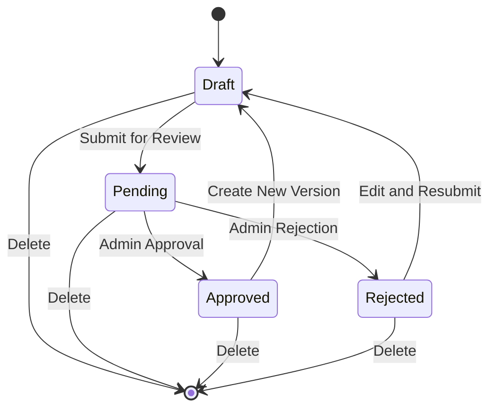
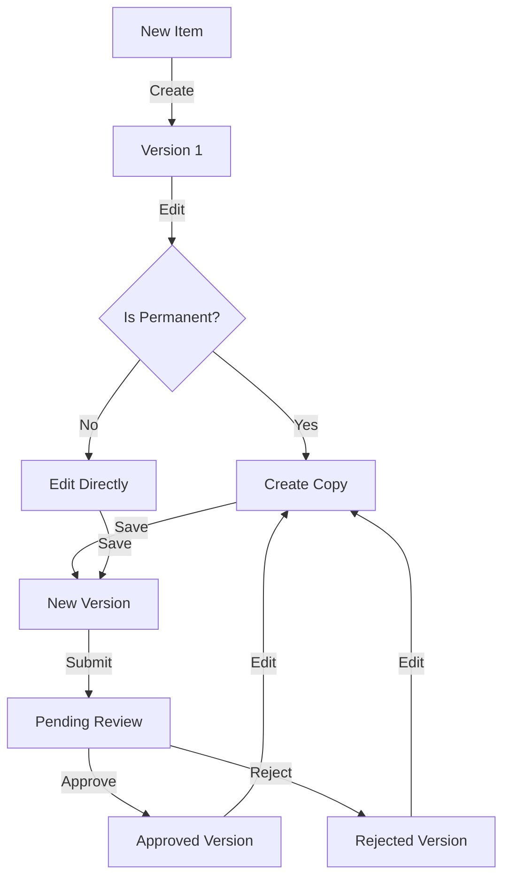
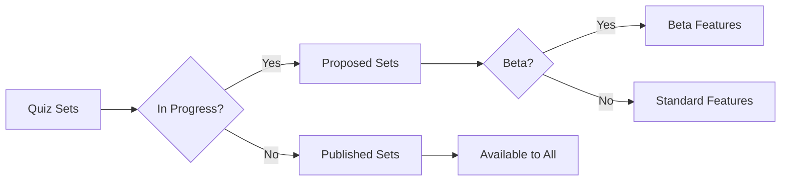
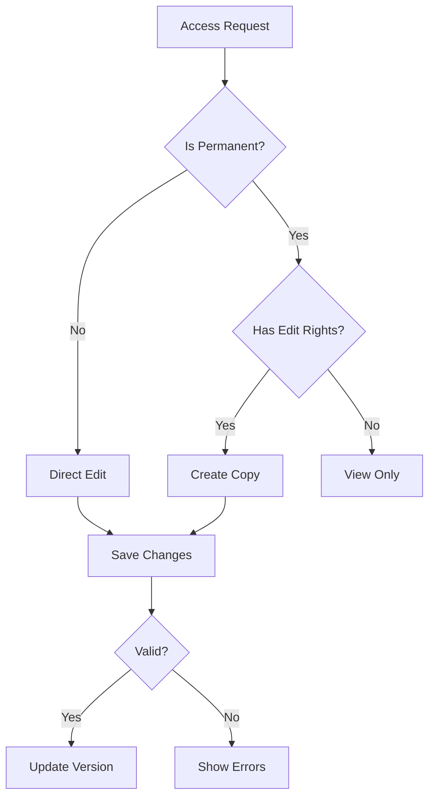
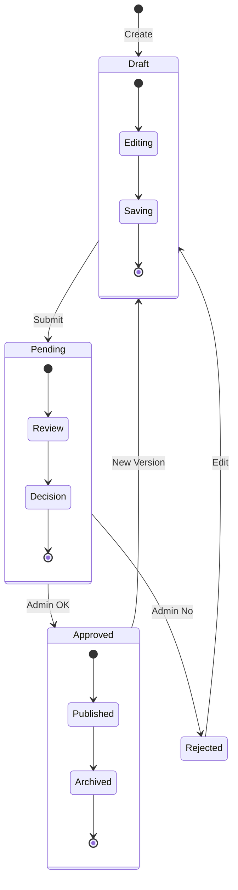

# Quiz Editor Logic Flow Documentation

This document outlines how key properties affect routing and editor behavior in the quiz system.

## Key Properties

### 1. `status` Property

#### Routing Effects
- Determines which editor view to show
- New items start as `'draft'`
- Existing items preserve their status
- Controls access to edit functionality

#### Editor Behavior
- Controls save/submit button visibility
- Determines validation requirements
- Affects UI feedback and messaging

### 2. `beta` Property

#### Routing Effects
- Affects quiz set visibility
- Controls access to beta features
- May restrict certain routes or views

#### Editor Behavior
- Shows additional UI elements for beta testing
- May enable experimental features
- Provides beta-specific feedback

### 3. `inProgress` Property

#### Routing Effects
- Determines quiz set visibility
- Separates published from proposed sets
- Affects navigation between views

#### Editor Behavior
- Shows special UI components for in-progress items
- Displays progress indicators
- Affects tab navigation and organization

### 4. `revisionNumber` and `version` Properties

#### Routing Effects
- Determines which version to load
- Controls version history access
- Affects navigation between versions

#### Editor Behavior
- Controls version history display
- Manages save behavior and versioning
- Tracks changes and maintains history

### 5. `isPermanent` Property

#### Routing Effects
- Determines if item can be edited directly
- Controls creation of draft copies
- Affects navigation between original and copies

#### Editor Behavior
- Controls edit permissions
- Affects save behavior
- Manages relationship between original and modified versions

## Key Interactions

### 1. Version Control Flow
- `version` and `revisionNumber` work together to track changes
- `isPermanent` determines if changes create new versions or modify existing ones
- Version history is maintained for all changes

### 2. Quiz Set Organization
- `inProgress` and `beta` work together to organize quiz sets
- `status` determines visibility and editability
- Sets can be filtered based on these properties

### 3. Editor Access Control
- `isPermanent` and `status` combine to control edit permissions
- `version` tracks changes and maintains history
- Access control is enforced at multiple levels

## Implementation Notes

1. New items always start with:
   ```javascript
   {
     status: 'draft',
     version: 1,
     isPermanent: false
   }
   ```

2. Version tracking:
   ```javascript
   if (existingVersion) {
     newVersion = existingVersion + 1;
   } else {
     newVersion = 1;
   }
   ```

3. Quiz set filtering:
   ```javascript
   const publishedQuizSets = quizSets.filter(set => !set.inProgress);
   const proposedQuizSets = quizSets.filter(set => set.inProgress);
   ```

4. Edit permissions:
   ```javascript
   if (item.isPermanent) {
     // Create a copy for editing
     const itemCopy = {
       ...item,
       originalId: itemId,
       isDraft: true
     };
   }
   ```

## State Transitions

1. **New Item Creation**:
   - `status`: 'draft'
   - `version`: 1
   - `isPermanent`: false

2. **Submitting for Review**:
   - `status`: 'pending'
   - `version`: preserved
   - `isPermanent`: false

3. **Approval**:
   - `status`: 'approved'
   - `version`: preserved
   - `isPermanent`: true

4. **Rejection**:
   - `status`: 'rejected'
   - `version`: preserved
   - `isPermanent`: false

5. **Deletion**:
   - `status`: 'deleted'
   - `version`: preserved
   - `isPermanent`: preserved

## Control Flow Diagrams

### 1. Quiz Item Lifecycle



### 2. Version Control Flow



### 3. Quiz Set Organization



### 4. Editor Access Control



### 5. State Transition Matrix



These diagrams illustrate:
1. The complete lifecycle of a quiz item
2. How version control works with permanent items
3. How quiz sets are organized and filtered
4. The access control flow for editing
5. Detailed state transitions for each major state

The diagrams use standard flowchart and state diagram notation to show:
- Decision points (diamonds)
- Processes (rectangles)
- States (rounded rectangles)
- Transitions (arrows)
- Start/End points (circles) 